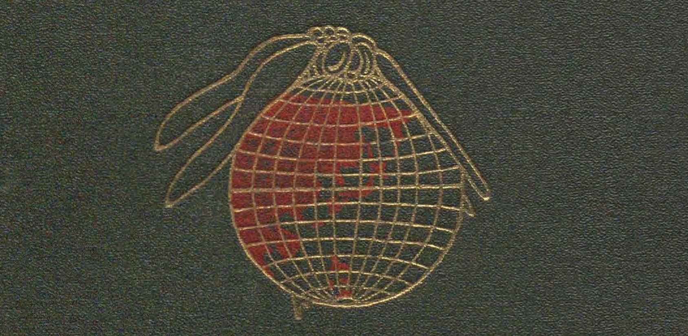

# togo
大日本地名辞書（吉田東伍）を[国立国会図書館デジタルコレクション](https://dl.ndl.go.jp/)で読み進める

1. 1907-10-17 [大日本地名辞書 汎論索引 二版](https://dl.ndl.go.jp/info:ndljp/pid/2937061) 293コマ　(読了)
2. 1907-10-17 [大日本地名辞書 上巻 二版](https://dl.ndl.go.jp/info:ndljp/pid/2937057) 933コマ
3. 1907-10-17 [大日本地名辞書 中巻 二版](https://dl.ndl.go.jp/info:ndljp/pid/2937058) 654コマ
4. 1907-10-17 [大日本地名辞書 下巻 二版](https://dl.ndl.go.jp/info:ndljp/pid/2937059) 820コマ
5. 1909-12-28 [大日本地名辞書 続編](https://dl.ndl.go.jp/info:ndljp/pid/2937060)　498コマ　←　北海道樺太
